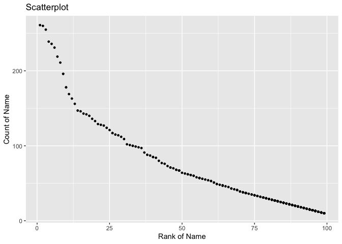

p8105\_hw2\_cw3370
================

# Problem 1

### Read and clean the Mr.Trash Wheel sheet

``` r
##specify the Mr. Trash Wheel sheet in the Excel file and to omit non-data entries
mr_trash_wheel_df <- 
  read_excel("data/Trash-Wheel-Collection-Totals-8-6-19.xlsx",sheet = "Mr. Trash Wheel",range = "A2:N408") %>% 
  janitor::clean_names() %>% 
  ##omit rows that do not include dumpster-specific data
  drop_na(dumpster) %>% 
  ##round the number of sports balls to the nearest integer
  mutate(sports_balls = round(sports_balls))
```

<font size = 4 face="Times New Roman">Mr.Trash Wheel sheet includes 344
observations for 14 variables. For variables, they are dumpster, month,
year, date, weight\_tons, volume\_cubic\_yards, plastic\_bottles,
polystyrene, cigarette\_butts, glass\_bottles, grocery\_bags,
chip\_bags, sports\_balls, homes\_powered.

dumpster is the number of dumpster. month, year, date is the date of
dumpster to be collected. weight\_tons, volume\_cubic\_yards,
plastic\_bottles, polystyrene, cigarette\_butts, glass\_bottles,
grocery\_bags, chip\_bags, sports\_balls, homes\_powered describe the
trash in the dumpster.

The median number of sports balls in a dumpster in 2019 is 8.5</font>

### Read and clean precipitation data for 2018 and 2019

``` r
## read the data
## filter() to omit rows without precipitation data
## mutate() to add the variable year,change the variable month to character
Precipitation2018_df <- 
  read_excel("data/Trash-Wheel-Collection-Totals-8-6-19.xlsx",sheet = "2018 Precipitation",range = "A2:B14") %>% 
  janitor::clean_names() %>%
  mutate(month = month.name,year = 2018) %>% 
  drop_na(total)

Precipitation2019_df <- 
  read_excel("data/Trash-Wheel-Collection-Totals-8-6-19.xlsx",sheet = "2019 Precipitation",range = "A2:B14") %>% 
  janitor::clean_names() %>%
  mutate(month = month.name,year = 2019) %>% 
  drop_na(total)

##bind data together
Precipitation_bind_df <- 
  bind_rows(Precipitation2018_df,Precipitation2019_df) %>% 
  relocate(year)
```

<font size = 4 face="Times New Roman">For the precipitation data for
2018,2019, we collected 18 month.

The total precipitation in 2018 is 70.33, including 12 month.

The total precipitation in 2019 is 16.67, only including 6 month.</font>

# Problem 2

``` r
#variable president:1 means the president was republican and -1 means the president was democratic
pols_month_df <- 
  read_csv("data/pols-month.csv") %>% 
  janitor::clean_names() %>%
  separate(mon,into = c("year","month","day"),sep = "-") %>% 
  mutate(year = as.integer(year),
         month = as.integer(month),
         day = as.integer(day),
         month = recode(month,`1` = month.name[1],`2` = month.name[2],`3` = month.name[3],`4` = month.name[4],`5` = month.name[5],`6` = month.name[6],`7` = month.name[7],`8` = month.name[8],`9` = month.name[9],`10` = month.name[10],`11` = month.name[11],`12` = month.name[12]),
         president = prez_gop - prez_dem) %>% 
  select(-prez_dem,-prez_gop,-day)
```

    ## Rows: 822 Columns: 9

    ## ─ Column specification ────────────────────────────
    ## Delimiter: ","
    ## dbl  (8): prez_gop, gov_gop, sen_gop, rep_gop, prez_dem, gov_dem, sen_dem, r...
    ## date (1): mon

    ## 
    ## ℹ Use `spec()` to retrieve the full column specification for this data.
    ## ℹ Specify the column types or set `show_col_types = FALSE` to quiet this message.

<font size = 4 face="Times New Roman">pols\_month\_df contains the data
from ‘pols\_month.csv’, including 822 observations of 9 related to the
number of national politicians who are democratic or republican from
year 1947 to year `r`max(select(pols\_month\_df,year))\`.

year, month are the month and day of count. gov\_gop, sen\_gop, rep\_gop
are the numbers of republican governors senator and representatives on
the count date. gov\_dem, sen\_dem, rep\_dem are the numbers of
democratic governors senator and representatives on the count date.
president are the indicators of the president, 1 means republican,-1
means democratic.</font>

``` r
snp_df <- 
  read_csv("data/snp.csv") %>% 
  janitor::clean_names() %>%
  separate(date,into = c("month","day","year"),sep = "/") %>% 
  mutate(year = as.integer(year),
         month = as.integer(month),
         day = as.integer(day)) %>% 
  select(-day) %>% 
  arrange(year,month) %>% 
  mutate(month = recode(month,`1` = month.name[1],`2` = month.name[2],`3` = month.name[3],`4` = month.name[4],`5` = month.name[5],`6` = month.name[6],`7` = month.name[7],`8` = month.name[8],`9` = month.name[9],`10` = month.name[10],`11` = month.name[11],`12` = month.name[12]),
         ) %>% 
  relocate(year,month)
```

    ## Rows: 787 Columns: 2

    ## ─ Column specification ────────────────────────────
    ## Delimiter: ","
    ## chr (1): date
    ## dbl (1): close

    ## 
    ## ℹ Use `spec()` to retrieve the full column specification for this data.
    ## ℹ Specify the column types or set `show_col_types = FALSE` to quiet this message.

<font size = 4 face="Times New Roman">snp\_df contains the data from
‘snp.csv’, including 787 observations of 3 variables related to Standard
& Poor’s stock market index (S&P) from year 1950 to year 2015.

year, month are the year of month. closeare the S&P.</font>

``` r
unemployment_df <- 
  read_csv("data/unemployment.csv") %>% 
  janitor::clean_names() %>%
  pivot_longer(
    jan:dec,
    names_to = "month",
    values_to = "unemployment"
  ) %>% 
  mutate(month = recode(month,"jan" = month.name[1],"feb" = month.name[2],"mar" = month.name[3],"aapr" = month.name[4],"may" = month.name[5],"jun" = month.name[6],"jul" = month.name[7],"aug" = month.name[8],"sep" = month.name[9],"oct" = month.name[10],"nov" = month.name[11],"dec" = month.name[12]),
         year = as.integer(year))
```

    ## Rows: 68 Columns: 13

    ## ─ Column specification ────────────────────────────
    ## Delimiter: ","
    ## dbl (13): Year, Jan, Feb, Mar, Apr, May, Jun, Jul, Aug, Sep, Oct, Nov, Dec

    ## 
    ## ℹ Use `spec()` to retrieve the full column specification for this data.
    ## ℹ Specify the column types or set `show_col_types = FALSE` to quiet this message.

<font size = 4 face="Times New Roman">unemployment\_df contains the data
from unemployment.csv, including 816 observations of 3 variables related
to the percentage of unemployment from year 1948 to year 2015.

year, month are the year and month. unemploymentare the percentage of
unemployment.</font>

``` r
## join by year and month
join_df <- 
  left_join(pols_month_df,snp_df,by = c("year","month")) %>% 
  left_join(unemployment_df,by =  c("year","month")) 

## use date to join
pols_month_df1 <- 
  mutate(
    pols_month_df,date = ymd(paste(as.character(year),month,1))
  )

snp_df1 <- 
  mutate(
    snp_df,date = ymd(paste(as.character(year),month,1))
  )

unemployment_df1 <- 
  mutate(
    unemployment_df,date = ymd(paste(as.character(year),month,1))
  )

join1_df <- 
  left_join(pols_month_df1,snp_df1,by = "date") %>% 
  left_join(unemployment_df1,by = "date") %>% 
  select(-year.y,-month.y,-year,-month,-date)

skimr::skim(join_df)
```

|                                                  |          |
|:-------------------------------------------------|:---------|
| Name                                             | join\_df |
| Number of rows                                   | 822      |
| Number of columns                                | 11       |
| \_\_\_\_\_\_\_\_\_\_\_\_\_\_\_\_\_\_\_\_\_\_\_   |          |
| Column type frequency:                           |          |
| character                                        | 1        |
| numeric                                          | 10       |
| \_\_\_\_\_\_\_\_\_\_\_\_\_\_\_\_\_\_\_\_\_\_\_\_ |          |
| Group variables                                  | None     |

Data summary

**Variable type: character**

| skim\_variable | n\_missing | complete\_rate | min | max | empty | n\_unique | whitespace |
|:---------------|-----------:|---------------:|----:|----:|------:|----------:|-----------:|
| month          |          0 |              1 |   3 |   9 |     0 |        12 |          0 |

**Variable type: numeric**

| skim\_variable | n\_missing | complete\_rate |    mean |     sd |      p0 |     p25 |     p50 |     p75 |    p100 | hist  |
|:---------------|-----------:|---------------:|--------:|-------:|--------:|--------:|--------:|--------:|--------:|:------|
| year           |          0 |           1.00 | 1980.75 |  19.79 | 1947.00 | 1964.00 | 1981.00 | 1998.00 | 2015.00 | ▇▇▇▇▇ |
| gov\_gop       |          0 |           1.00 |   22.48 |   5.68 |   12.00 |   18.00 |   22.00 |   28.00 |   34.00 | ▆▆▇▅▅ |
| sen\_gop       |          0 |           1.00 |   46.10 |   6.38 |   32.00 |   42.00 |   46.00 |   51.00 |   56.00 | ▃▃▇▇▇ |
| rep\_gop       |          0 |           1.00 |  194.92 |  29.24 |  141.00 |  176.00 |  195.00 |  222.00 |  253.00 | ▃▇▆▃▅ |
| gov\_dem       |          0 |           1.00 |   27.20 |   5.94 |   17.00 |   22.00 |   28.00 |   32.00 |   41.00 | ▆▅▇▆▂ |
| sen\_dem       |          0 |           1.00 |   54.41 |   7.37 |   44.00 |   48.00 |   53.00 |   58.00 |   71.00 | ▇▆▇▃▂ |
| rep\_dem       |          0 |           1.00 |  244.97 |  31.37 |  188.00 |  211.00 |  250.00 |  268.00 |  301.00 | ▇▂▇▇▅ |
| president      |          0 |           1.00 |    0.06 |   1.01 |   -1.00 |   -1.00 |    1.00 |    1.00 |    2.00 | ▇▁▁▇▁ |
| close          |         36 |           0.96 |  472.85 | 543.29 |   17.05 |   83.67 |  137.26 |  932.06 | 2107.39 | ▇▁▂▁▁ |
| unemployment   |         80 |           0.90 |    5.83 |   1.65 |    2.50 |    4.62 |    5.60 |    6.90 |   10.80 | ▃▇▅▂▁ |

<font size = 4 face="Times New Roman">We use two ways to join these
data. The first one is to left join by year and month. The second one is
to create a Date variable by ymd() and join by this Date variable. The
outcome is same.

join\_df includes 822 observations of 11 variables. It includes the
number of national politicians who are democratic or republican from
year 1947 to year2015, Standard & Poor’s stock market index (S&P) from
year 1950 to year 2015,percentage of unemployment from year1948 to year
2015.

The key variable in join\_df is the same as three dataframe above. So l
don’t explain again.</font>

# Problem 3

``` r
popular_babyname_df1 <- 
  read_csv("data/Popular_Baby_Names.csv") %>% 
  janitor::clean_names() %>%
  distinct() %>% 
  mutate(
    gender = str_to_title(gender),
    ethnicity = str_to_title(ethnicity), 
    ethnicity = recode(
      ethnicity,
      "Asian And Pacific Islander" = "Asian And Paci",
      "Black Non Hispanic" = "Black Non Hisp",
      "White Non Hispanic" = "White Non Hisp"
      ),
    childs_first_name = str_to_title(childs_first_name)
    )
```

    ## Rows: 19418 Columns: 6

    ## ─ Column specification ────────────────────────────
    ## Delimiter: ","
    ## chr (3): Gender, Ethnicity, Child's First Name
    ## dbl (3): Year of Birth, Count, Rank

    ## 
    ## ℹ Use `spec()` to retrieve the full column specification for this data.
    ## ℹ Specify the column types or set `show_col_types = FALSE` to quiet this message.

``` r
oliva_df <- 
  filter(popular_babyname_df1,childs_first_name == "Olivia",gender == "Female") %>% 
  select(-count,-gender,-childs_first_name) %>% 
  pivot_wider(
    names_from = "year_of_birth",
    names_sort = TRUE,
    values_from = "rank"
  ) 

popular_male_name_df <- 
  filter(popular_babyname_df1,rank == 1,gender == "Male") %>% 
  select(-rank,-count,-gender) %>% 
  pivot_wider(
    names_from = "year_of_birth",
    names_sort = TRUE,
    values_from = "childs_first_name"
  ) 

male_wnh_2016_df <- 
  filter(popular_babyname_df1,ethnicity == "White Non Hisp",year_of_birth == 2016,gender == "Male") %>% 
  select(-ethnicity,-year_of_birth,-gender)

ggplot(data = male_wnh_2016_df, aes(x = rank ,y = count,size = count)) + 
    geom_point(size = 1) +
    labs(title = "Scatterplot" , x = "Rank of Name" , y = "Count of Name")
```

<!-- -->
